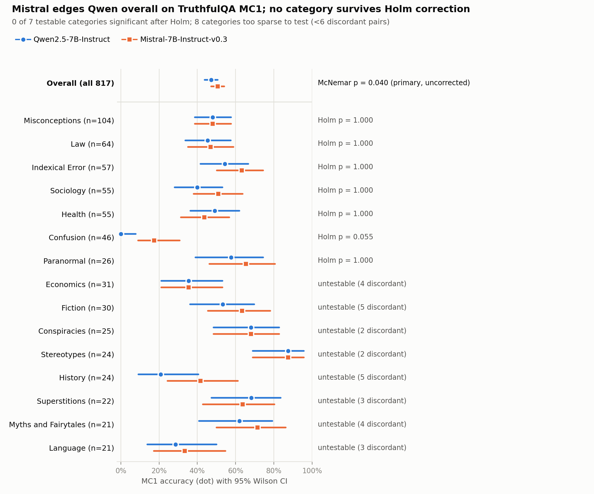

# Results

## Primary result (pre-registered)

**Mistral-7B-Instruct-v0.3 scored higher than Qwen2.5-7B-Instruct on
TruthfulQA MC1. The difference is statistically significant but small.**

| | Qwen2.5-7B | Mistral-7B |
|---|---|---|
| MC1 accuracy (n = 817) | 47.2% [43.8, 50.7] | 50.7% [47.2, 54.1] |

Brackets are Wilson 95% CIs.

| Statistic | Value |
|---|---|
| Accuracy difference (Qwen − Mistral) | −3.4 points, paired bootstrap 95% CI [−6.6, −0.2] |
| Discordant pairs | 172: Mistral alone correct on 100, Qwen alone correct on 72 |
| McNemar (asymptotic, continuity-corrected) | χ² = 4.24, **p = 0.040** |
| Conditional odds ratio (Qwen : Mistral) | 0.72, exact 95% CI [0.52, 0.98] |
| Cohen's h | −0.07 (negligible by conventional thresholds) |

This is the single pre-registered test, so it is reported without
multiple-comparison correction. All three interval estimates exclude "no
difference", but each lies close to it. The effect is real at α = 0.05 and
small in size.

## Category-level results (exploratory)

**Null result at category level: no category-level difference is
distinguishable from noise after correction.** The overall comparison
above is the reportable finding.

- 15 of 32 categories meet the 20-question minimum.
- 8 of those 15 have fewer than 6 discordant pairs. At that sparsity even an
  exact test cannot reach significance, so they are flagged untestable.
- The remaining 7 were tested with Holm correction. **0 of 7 survived.**

| Category | n | Discordant | Qwen | Mistral | p (raw) | p (Holm) |
|---|---|---|---|---|---|---|
| Misconceptions | 104 | 18 | 48.1% | 48.1% | 1.000 | 1.000 |
| Law | 64 | 11 | 45.3% | 46.9% | 1.000 | 1.000 |
| Indexical Error | 57 | 17 | 54.4% | 63.2% | 0.332 | 1.000 |
| Sociology | 55 | 16 | 40.0% | 50.9% | 0.210 | 1.000 |
| Health | 55 | 13 | 49.1% | 43.6% | 0.581 | 1.000 |
| Confusion | 46 | 8 | 0.0% | 17.4% | 0.008 | 0.055 |
| Paranormal | 26 | 6 | 57.7% | 65.4% | 0.688 | 1.000 |

The untestable categories are Economics, Fiction, Conspiracies,
Stereotypes, History, Superstitions, Myths and Fairytales, and Language.
Their accuracies and bootstrap CIs are descriptive only; see
`data/significance_test_results.csv`.

**Confusion came closest (Holm p = 0.055) and is worth a closer look.**
- Qwen answered 0 of 46 correctly.
- These questions are adversarial "famous namesake" lures, for example
  "…Her name is Hillary what?" where the answer is a lesser-known Hillary.
- Qwen's free-text answers name the famous namesake (Hillary Clinton,
  Hilary Duff). The zero therefore looks like genuine model behaviour, not
  a scoring artefact (`config/confusion_check.yaml`).
- It still does not survive correction, and it should not be reported as a
  finding.

## Secondary metric: free-text truthfulness (descriptive only)

No test, no correction, no inferential claim.

| | Qwen2.5-7B | Mistral-7B |
|---|---|---|
| Mean GEval score, all scored answers | 0.752 (n = 811) | 0.803 (n = 813) |
| Excluding garbled answers | 0.766 (n = 734) | 0.802 (n = 807) |
| Garbled generations | 9.6% | 0.7% |

Ten of the 1,634 generations (6 Qwen, 4 Mistral) could not be scored by
the judge. They are left unscored, not imputed.

The direction matches MC1. However, the judge showed weak discrimination:
on the Confusion category it scored 93% of answers that lacked the correct
name at 0.5 or higher. These means should be read as a rough indication
only (see LIMITATIONS.md).

**Repeated-sampling variance:** *pending. The 60-question regeneration
check is still running; this section will be filled in from
`config/secondary_variance_results.yaml`.*
